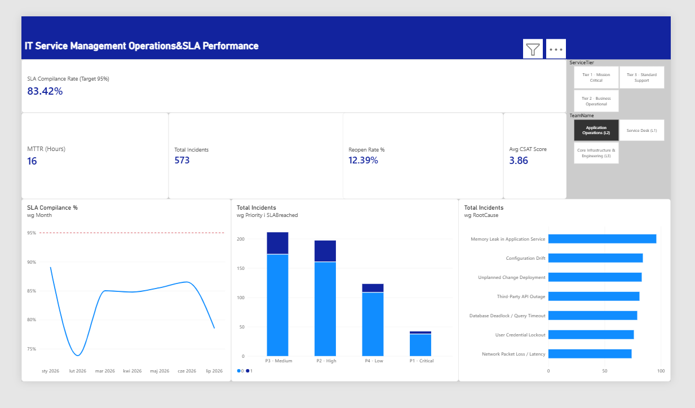

# enterprise_itsm_sla_analytics

Interactive Power BI Dashboard &amp; Star Schema model for IT operations, SLA Adherence Monitoring and ITTL Major Incident Escalation
# Enterprise ITSM Incident Analytics & SLA Monitoring System

An interactive IT Service Management (ITSM) analytics dashboard built in **Power BI**, modeled using a **Star Schema**, and aligned with **ITIL 4 Service Operations** standards. 

This project simulates operational monitoring for enterprise-scale IT services (SAP ERP Core, Global IAM, Cloud Infrastructure), tracking SLA compliance, Mean Time to Resolution (MTTR), and incident root causes.

---

##  Project Overview & Objectives

In modern IT Operations (SMO), maintaining high availability and meeting Service Level Agreements (SLAs) is critical to business continuity. 

**Key Goals:**
* Track **SLA Compliance %** against a target threshold of **95.0%**.
* Monitor **Mean Time to Resolution (MTTR)** across support tiers (L1, L2, L3).
* Perform **Root Cause Analysis (RCA)** to identify recurring operational bottlenecks.
* Provide an actionable decision-support tool for IT Service Managers.

---

##  Data Architecture & Star Schema Model

The data model follows standard dimensional modeling practices to ensure query performance and clear cross-filtering:

* **`Fact_Incidents`**: 1,500 service records capturing incident lifecycle events, target SLA hours, actual resolution durations, reopen flags, and CSAT scores.
* **`Dim_Services`**: Service hierarchy, criticality classification (*Tier 1 Mission-Critical* to *Tier 3 Standard Support*), and service ownership.
* **`Dim_Teams`**: Support tiers (*Service Desk L1*, *Application Operations L2*, *Core Engineering L3*).
* **`Dim_Calendar`**: Dedicated DAX time-intelligence dimension supporting chronological trend analysis.

---

##  Core DAX Measures

```dax
// SLA Compliance Rate
SLA Compliance % = 
DIVIDE(
    [Total Incidents] - [SLA Breaches],
    [Total Incidents],
    0
)

// Mean Time to Resolution (MTTR)
MTTR (Hours) = AVERAGE(Fact_Incidents[ResolutionTimeHours])

// Reopen Rate
Reopen Rate % = 
DIVIDE(
    CALCULATE(COUNTROWS(Fact_Incidents), Fact_Incidents[ReopenCount] > 0),
    [Total Incidents],
    0
)

